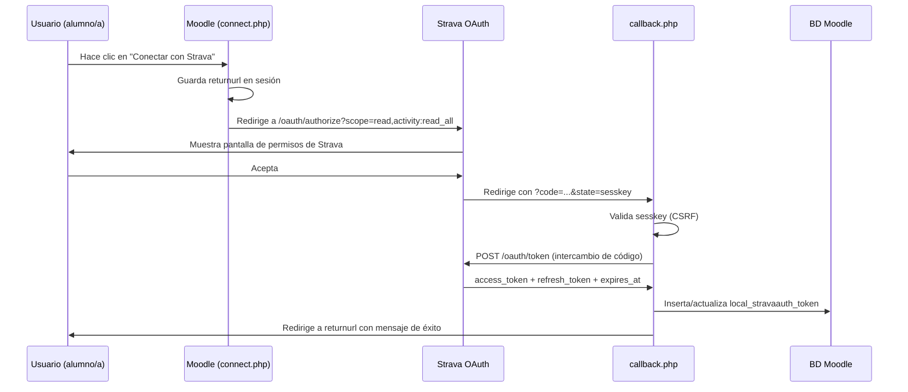

# local_stravaauth — Autenticación OAuth2 con Strava para Moodle


Plugin local de Moodle que implementa el flujo **OAuth 2.0** de [Strava](https://www.strava.com) y expone un cliente de la **API v3** para que otros plugins (como `mod_strava`) puedan consultar las actividades deportivas de los usuarios sin gestionar tokens propios.

---

## Índice

- [¿Qué hace este plugin?](#qué-hace-este-plugin)
- [Requisitos](#requisitos)
- [Registro de la aplicación en Strava](#registro-de-la-aplicación-en-strava)
- [Instalación](#instalación)
- [Configuración en Moodle](#configuración-en-moodle)
- [Flujo de conexión del usuario](#flujo-de-conexión-del-usuario)
- [API pública para otros plugins](#api-pública-para-otros-plugins)
- [Base de datos](#base-de-datos)
- [Privacidad y RGPD](#privacidad-y-rgpd)
- [Referencia de la API de Strava](#referencia-de-la-api-de-strava)

---

## ¿Qué hace este plugin?

`local_stravaauth` actúa como capa de autenticación y acceso a la API de Strava para toda la plataforma Moodle:

- Implementa el flujo **Authorization Code** de OAuth 2.0 con Strava.
- Almacena y **refresca automáticamente** los tokens de acceso cuando caducan.
- Expone la clase `\local_stravaauth\api_client` como interfaz única para que cualquier otro plugin consulte la API de Strava en nombre de un usuario.
- Indica visualmente al usuario si ya tiene su cuenta vinculada.

```
┌─────────────┐      OAuth 2.0 redirect       ┌───────────────────┐
│   Usuario   │ ─────────────────────────────► │  strava.com/oauth │
│  (Moodle)   │ ◄───────────────────────────── │  /authorize       │
└─────────────┘   code + state (sesskey)       └───────────────────┘
       │
       │  callback.php intercambia el código
       ▼
┌────────────────────────┐   POST token   ┌─────────────────────────┐
│  local_stravaauth      │ ─────────────► │  strava.com/oauth/token │
│  callback.php          │ ◄───────────── │  access_token +         │
└────────────────────────┘                │  refresh_token          │
       │                                  └─────────────────────────┘
       │  guarda en BD
       ▼
┌────────────────────────────┐
│  mdl_local_stravaauth_token│
│  (userid, access, refresh) │
└────────────────────────────┘
```

---

## Requisitos

| Componente | Versión mínima |
|---|---|
| Moodle | 4.1 (build 2022112800) |
| PHP | 8.1 |
| Extensión `curl` de PHP | requerida |

---

## Registro de la aplicación en Strava

Antes de configurar el plugin en Moodle debes crear una aplicación en el panel de desarrolladores de Strava:

1. Accede a **[https://developers.strava.com/](https://developers.strava.com/)** e inicia sesión con tu cuenta de Strava.
2. Ve a **[My API Application](https://www.strava.com/settings/api)** (menú superior derecho → *Settings* → *My API Application*).
3. Rellena los campos:

   | Campo | Valor de ejemplo |
   |---|---|
   | Application Name | Mi Moodle |
   | Category | Education |
   | Club | *(vacío o el tuyo)* |
   | Website | `https://moodle.example.com` |
   | Authorization Callback Domain | `moodle.example.com` |

4. Guarda y anota el **Client ID** y el **Client Secret** que aparecen en la página de tu aplicación.

> **Importante — URL de callback exacta**
>
> El campo *Authorization Callback Domain* en Strava sólo acepta el dominio (sin ruta). Sin embargo, al configurar el plugin en Moodle, la pantalla de ajustes te mostrará la URL completa de callback que debes registrar. Cópiala tal cual.

---

## Instalación

```bash
# Desde la raíz de Moodle
cp -r local/stravaauth /var/www/html/moodle/local/stravaauth

# O mediante Git
git clone <repo> local/stravaauth
```

Después, accede a **Administración del sitio → Notificaciones** para que Moodle ejecute el instalador de base de datos y cree la tabla `mdl_local_stravaauth_token`.

---

## Configuración en Moodle

Ruta: **Administración del sitio → Plugins → Plugins locales → Autenticación con Strava**

| Ajuste | Descripción |
|---|---|
| **Client ID** | El número de Client ID de tu aplicación en strava.com/settings/api |
| **Client Secret** | La clave secreta de tu aplicación |
| **URL de callback** | Informativa. Cópiala y pégala en el panel de Strava |


*(captura de la página de configuración)*

---

## Flujo de conexión del usuario



El usuario sólo necesita autorizar **una vez**. A partir de entonces el plugin refresca el token automáticamente cuando está a punto de caducar (margen de 5 minutos).

---

## API pública para otros plugins

La clase `\local_stravaauth\api_client` es la única interfaz que deben usar los plugins dependientes:

```php
use local_stravaauth\api_client;

// ¿El usuario tiene la cuenta vinculada?
if (!api_client::is_connected($userid)) {
    // mostrar botón "Conectar con Strava"
}

// Llamada autenticada a la API (el token se refresca si es necesario)
$activities = api_client::get($userid, 'athlete/activities', [
    'after'    => strtotime('2026-01-01'),
    'before'   => strtotime('2026-12-31'),
    'per_page' => 50,
]);

// Iniciar el flujo de autorización (redirige al usuario)
$url = api_client::get_authorize_url(sesskey());
redirect($url);
```

### Métodos disponibles

| Método | Descripción |
|---|---|
| `is_connected(int $userid): bool` | Comprueba si el usuario tiene token almacenado |
| `get_authorize_url(string $state): string` | Construye la URL de autorización de Strava |
| `exchange_code(int $userid, string $code): stdClass` | Intercambia el código OAuth por tokens y los persiste |
| `get_valid_access_token(int $userid): string` | Devuelve un access token válido (refresca si está caducado) |
| `get(int $userid, string $endpoint, array $params): array` | Petición GET autenticada a la API v3 de Strava |

### Permisos (scopes) solicitados

El plugin solicita los scopes `read` y `activity:read_all`, suficientes para leer el perfil del atleta y todas sus actividades (incluidas las privadas).

> **Cambio de URL base previsto**
>
> Strava ha anunciado que `https://www.strava.com/api/v3` pasará a `https://api-v3.strava.com` en enero de 2027. La URL base está centralizada en la constante `api_client::API_BASE` para facilitar el cambio.

---

## Base de datos

### `mdl_local_stravaauth_token`

| Columna | Tipo | Descripción |
|---|---|---|
| `id` | INT | Clave primaria |
| `userid` | INT | FK → `mdl_user.id` (índice único) |
| `athleteid` | INT | ID del atleta en Strava |
| `accesstoken` | TEXT | Token de acceso OAuth2 |
| `refreshtoken` | TEXT | Token de refresco OAuth2 |
| `expiresat` | INT | Unix timestamp de expiración del access token |
| `scope` | VARCHAR(255) | Permisos concedidos por el usuario |
| `timecreated` | INT | Fecha de vinculación inicial |
| `timemodified` | INT | Fecha de última actualización del token |

---

## Privacidad y RGPD

El plugin implementa la interfaz `\core_privacy\local\metadata\provider` y declara todos los datos personales que almacena:

- **`local_stravaauth_token`**: tokens OAuth2 y el ID de atleta de Strava del usuario.
- **Datos externos**: al realizar llamadas a la API de Strava se envían datos de identificación del usuario (token de acceso) a los servidores de Strava.

Los datos se exportan y eliminan correctamente a través de las herramientas de privacidad de Moodle.

---

## Referencia de la API de Strava

- **Portal de desarrolladores**: [https://developers.strava.com/](https://developers.strava.com/)
- **Referencia completa de la API v3**: [https://developers.strava.com/docs/reference/](https://developers.strava.com/docs/reference/)
- **Guía de autenticación OAuth2**: [https://developers.strava.com/docs/authentication/](https://developers.strava.com/docs/authentication/)
- **Gestión de tu aplicación**: [https://www.strava.com/settings/api](https://www.strava.com/settings/api)

---

## Licencia

GNU GPL v3 — consulta el fichero `LICENSE` o visita [gnu.org/licenses/gpl-3.0](https://www.gnu.org/licenses/gpl-3.0.html).
