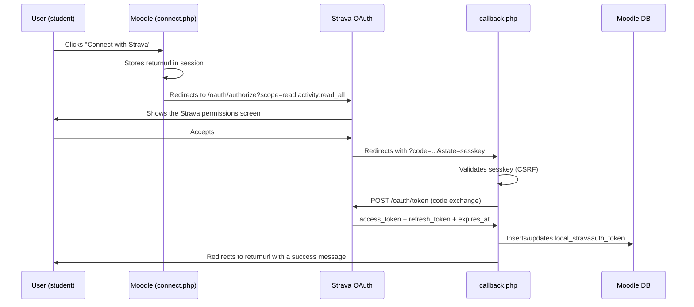

# local_stravaauth — Strava OAuth2 authentication for Moodle


Moodle local plugin that implements the [Strava](https://www.strava.com) **OAuth 2.0** flow and exposes a **v3 API** client, so that other plugins (such as `mod_strava`) can query users' sporting activities without managing their own tokens.

*Documentación en español: [README.es.md](README.es.md).*

---

## Table of contents

- [What does this plugin do?](#what-does-this-plugin-do)
- [Requirements](#requirements)
- [Registering the application in Strava](#registering-the-application-in-strava)
- [Installation](#installation)
- [Configuration in Moodle](#configuration-in-moodle)
- [User connection flow](#user-connection-flow)
- [Public API for other plugins](#public-api-for-other-plugins)
- [Database](#database)
- [Privacy and GDPR](#privacy-and-gdpr)
- [Strava API reference](#strava-api-reference)
- [License](#license)

---

## What does this plugin do?

`local_stravaauth` acts as the authentication and Strava API access layer for the whole Moodle site:

- Implements the OAuth 2.0 **Authorization Code** flow with Strava.
- Stores and **automatically refreshes** access tokens when they expire.
- Exposes the `\local_stravaauth\api_client` class as the single interface for any other plugin to query the Strava API on behalf of a user.
- Shows the user whether their account is already linked.

```
┌─────────────┐      OAuth 2.0 redirect       ┌───────────────────┐
│    User     │ ─────────────────────────────► │  strava.com/oauth │
│  (Moodle)   │ ◄───────────────────────────── │  /authorize       │
└─────────────┘   code + state (sesskey)       └───────────────────┘
       │
       │  callback.php exchanges the code
       ▼
┌────────────────────────┐   POST token   ┌─────────────────────────┐
│  local_stravaauth      │ ─────────────► │  strava.com/oauth/token │
│  callback.php          │ ◄───────────── │  access_token +         │
└────────────────────────┘                │  refresh_token          │
       │                                  └─────────────────────────┘
       │  saved in the database
       ▼
┌────────────────────────────┐
│  mdl_local_stravaauth_token│
│  (userid, access, refresh) │
└────────────────────────────┘
```

---

## Requirements

| Component | Minimum version |
|---|---|
| Moodle | 4.1 (build 2022112800) |
| PHP | 8.1 |
| PHP `curl` extension | required |

---

## Registering the application in Strava

Before configuring the plugin in Moodle you must create an application in the Strava developer dashboard:

1. Go to **[https://developers.strava.com/](https://developers.strava.com/)** and log in with your Strava account.
2. Open **[My API Application](https://www.strava.com/settings/api)** (top-right menu → *Settings* → *My API Application*).
3. Fill in the fields:

   | Field | Example value |
   |---|---|
   | Application Name | My Moodle |
   | Category | Education |
   | Club | *(empty or your own)* |
   | Website | `https://moodle.example.com` |
   | Authorization Callback Domain | `moodle.example.com` |

4. Save and note the **Client ID** and **Client Secret** shown on your application page.

> **Important — exact callback URL**
>
> The *Authorization Callback Domain* field in Strava only accepts the domain (no path). However, when configuring the plugin in Moodle, the settings page shows the full callback URL that you must register. Copy it as is.

---

## Installation

```bash
# From the Moodle root
cp -r local/stravaauth /var/www/html/moodle/local/stravaauth

# Or via Git
git clone <repo> local/stravaauth
```

Then go to **Site administration → Notifications** so Moodle runs the database installer and creates the `mdl_local_stravaauth_token` table.

---

## Configuration in Moodle

Path: **Site administration → Plugins → Local plugins → Strava authentication**

| Setting | Description |
|---|---|
| **Client ID** | The Client ID of your application at strava.com/settings/api |
| **Client Secret** | The secret key of your application |
| **Callback URL** | Informational. Copy it and paste it into the Strava dashboard |

---

## User connection flow



The user only needs to authorise **once**. From then on the plugin refreshes the token automatically when it is about to expire (5-minute margin).

---

## Public API for other plugins

The `\local_stravaauth\api_client` class is the only interface dependent plugins should use:

```php
use local_stravaauth\api_client;

// Is the user's account linked?
if (!api_client::is_connected($userid)) {
    // show the "Connect with Strava" button
}

// Authenticated API call (the token is refreshed if needed)
$activities = api_client::get($userid, 'athlete/activities', [
    'after'    => strtotime('2026-01-01'),
    'before'   => strtotime('2026-12-31'),
    'per_page' => 50,
]);

// Start the authorisation flow (redirects the user)
$url = api_client::get_authorize_url(sesskey());
redirect($url);
```

### Available methods

| Method | Description |
|---|---|
| `is_connected(int $userid): bool` | Checks whether the user has a stored token |
| `get_authorize_url(string $state): string` | Builds the Strava authorisation URL |
| `exchange_code(int $userid, string $code): stdClass` | Exchanges the OAuth code for tokens and stores them |
| `get_valid_access_token(int $userid): string` | Returns a valid access token (refreshes it if expired) |
| `get(int $userid, string $endpoint, array $params): array` | Authenticated GET request to the Strava v3 API |

### Requested permissions (scopes)

The plugin requests the `read` and `activity:read_all` scopes, enough to read the athlete's profile and all of their activities (including private ones).

> **Planned base URL change**
>
> Strava has announced that `https://www.strava.com/api/v3` will become `https://api-v3.strava.com` in January 2027. The base URL is centralised in the `api_client::API_BASE` constant to make the change easy.

---

## Database

### `mdl_local_stravaauth_token`

| Column | Type | Description |
|---|---|---|
| `id` | INT | Primary key |
| `userid` | INT | FK → `mdl_user.id` (unique index) |
| `athleteid` | INT | Athlete ID in Strava |
| `accesstoken` | TEXT | OAuth2 access token |
| `refreshtoken` | TEXT | OAuth2 refresh token |
| `expiresat` | INT | Unix timestamp when the access token expires |
| `scope` | VARCHAR(255) | Permissions granted by the user |
| `timecreated` | INT | Date of the initial link |
| `timemodified` | INT | Date of the last token update |

---

## Privacy and GDPR

The plugin implements the `\core_privacy\local\metadata\provider` interface and declares all the personal data it stores:

- **`local_stravaauth_token`**: OAuth2 tokens and the user's Strava athlete ID.
- **External data**: when calling the Strava API, user identification data (the access token) is sent to Strava's servers.

Data is exported and deleted correctly through Moodle's privacy tools.

---

## Strava API reference

- **Developer portal**: [https://developers.strava.com/](https://developers.strava.com/)
- **Full API v3 reference**: [https://developers.strava.com/docs/reference/](https://developers.strava.com/docs/reference/)
- **OAuth2 authentication guide**: [https://developers.strava.com/docs/authentication/](https://developers.strava.com/docs/authentication/)
- **Manage your application**: [https://www.strava.com/settings/api](https://www.strava.com/settings/api)

---

## License

GNU GPL v3 or later — see the `LICENSE` file or visit [gnu.org/licenses/gpl-3.0](https://www.gnu.org/licenses/gpl-3.0.html).
